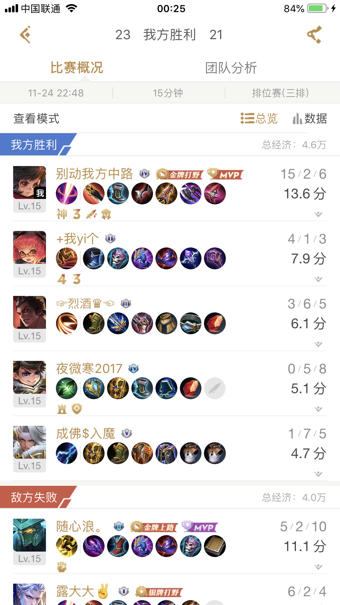
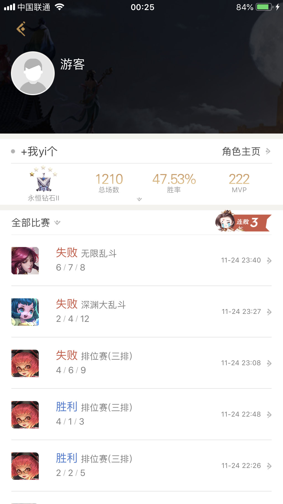

# WZRY-online-notice-server
王者荣耀上线提醒 服务端

## 语言工具
Golang + MySQL

## 实现功能

因为iOS与安卓的互通性, 导致不同渠道的玩家, 无法通过盒子订阅上线提醒, 但是我发现曾经一起对战过的话, 是可以通过玩家信息页面查询在线状态, 通过抓取盒子的接口找到了一段请求, 通过循环请求这个接口达到上限提醒的目的

对战详情页 | 玩家信息页
 -------------|-------------
 | 

在线状态一旦改变, 通过`APP push`或`Socket`实现提醒, 并记录在数据库中, 实现统计、分析的功能

目前需要通过抓包工具获取目标用户的id、cookie、登录token, 并添加到变量中

## TODO
- [x] 实现轮询功能, 包含接口请求、响应解析
- [x] 实现定制化时间, 因为每天有固定的请求限额, 尽量分散在需要监听的时间段
- [x] 实现状态查询的接口服务
- [ ] 实现状态变更后的持久, 用户状态变更需要保存在数据库中
- [ ] 实现推送功能, 计划使用[信鸽推送](https://xg.qq.com/), 已支持[服务端Golang接口](https://github.com/xingePush/xinge-api-Golang)
- [ ] 实现`Socket`连接, 更快速推送状态变更消息